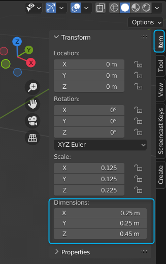
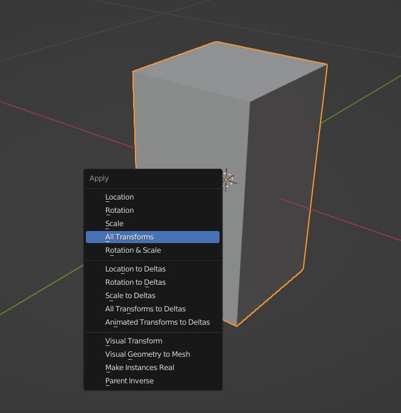
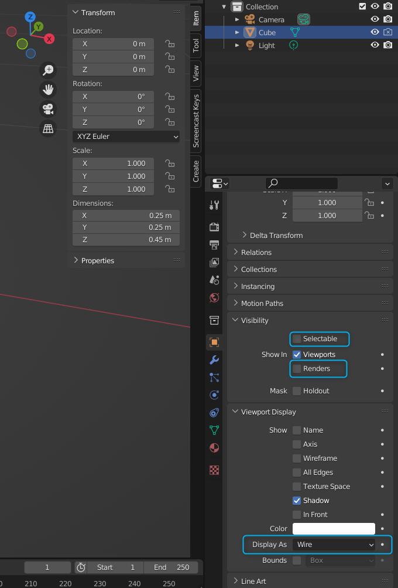

# 1.3. ランプのモデリング

## 概要
この節ではちょっとしたランプのモデリングを通して，メッシュの基本的な変形について扱います．
最初のモデリングなので，細かい部分を無視してそれっぽい形にすることを目指します．

また，マテリアルの基本的な部分についても扱います．
今回はテクスチャは使いません．テクスチャの使い方についてはおいおいやります．

まずはじめに今回使う内容の基本的な部分について解説し，その後 Blender で作業します．
Blender は細かい操作なども多いので，モデリングする画面の録画を残しておきます．
録画を見ながら実際に作業してみてください！

------

## 主な流れ

僕はモデリングするときは以下のような流れで制作することが多いです．
もちろん，場合によって順番を変えることもあります．
制作しやすい順番に調整してください．

1. サイズの確認
2. モデリング
3. マテリアルの設定
4. カメラ・ライティング
5. レンダリング
6. コンポジット

## サイズの確認

モデリングをする際，以下のような理由からサイズを実際のものに合わせることが多いです．
1. 他の3Dモデルと当時に使う際に，サイズのバランスが崩れないように
2. カメラの被写界深度などが現実に近くなりリアリティが増す

実在するものの完全なコピーをモデリングしたいとき以外は細かい部分などのサイズなどを合わせる必要はありませんが，
大まかなサイズは合わせておくのがおすすめです．

そこで，僕はよく立方体でサイズの下書きのようなものを作っておき，
それに合わせてモデリングしていくことが多いです．

### やり方
モデリングしていくことが多いです．

### やり方

1. 立方体を追加（SHift + A -> Mesh -> Cube）

2. N を押してサイドバーを表示

3. Item タブの中の Transform / Dimensions にサイズを入力
    

4. Transform / Location の Z に 3. で Z に入力した値の半分の値を入力

    底面の Z 座標が 0 になるようにするためです．

5. Ctrl + A -> (Apply) All Transform

    今回はあまり影響ありませんが Scale の値が 1 でないとき，一部のモディファイアなどがうまく動かないことがあります．

    （Transform でのサイズなどは最後に適用されるため，円になるように作ったものが潰れてしまったりします）

    なので，変形後の形にしか興味がない場合などでは Apply Transform で変形を元のメッシュに適用するのがおすすめです．
    これにより，Scale の値はすべて 1 になります

    

6. Object Properties で Visibility の Selectable, Renders を OFF に
7. その下のほうにある Display / Display As を Wire に変更

    下書きは最終的な出力に必要ないので，Renders では表示しないように設定しておきます．
    また，この下書きを今後操作することはほとんどないので，Selectable を OFF にし，
    選択されないようにしておきます．

    また，表示方法が元のままだと他のオブジェクトを隠してしまうので，
    ワイヤーフレーム表示に変更します．

    

## モデリング

