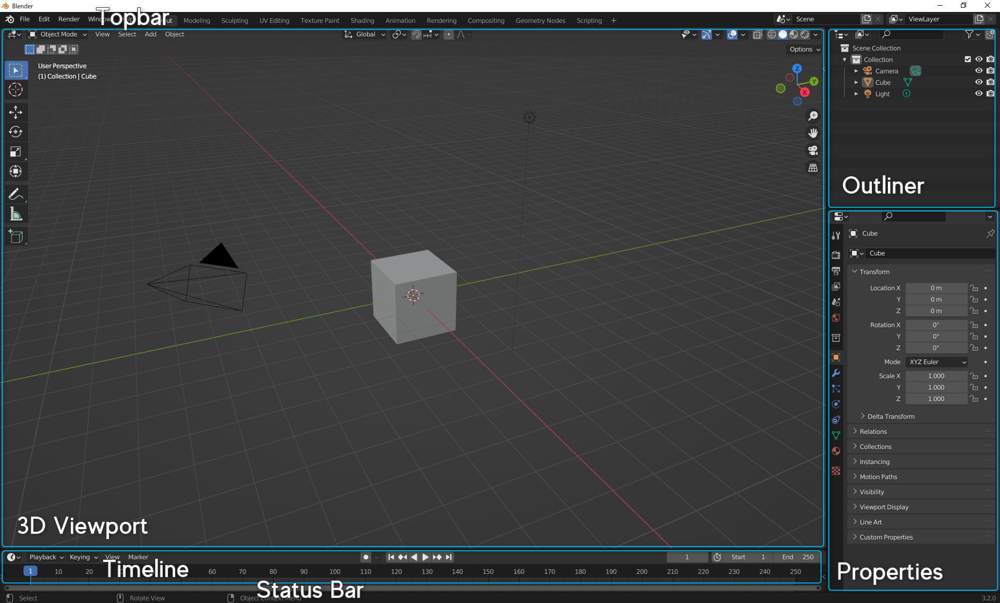

# 1.2. Blender を使ってみる

## 概要

この節では、Blender の画面の見方や視点操作、移動・回転・拡大縮小、およびレンダリングについて扱います。

## Blender の起動画面

Blender を起動すると以下のような画面が表示されると思います。

起動時には、Topbar, Status Bar の他に以下の「エリア」と呼ばれるものが表示されています。

- 3D Viewport
- Outliner
- Properties
- Timeline

<!--    //蛇足な気がする...
Topbar には様々なコマンド（ショートカットで代用することが多い）及びレイアウトを選択するタブが表示されています。

Status Bar にはマウスの機能、及びセーブなどの通知が表示されます。
マウスの機能はCtrl, Shiftなどの押下によって表示が変わります。
-->

Blender での作業は基本的にはこれらのエリアで行います。以下ではその中で特に重要な 3D Viewport, Outliner, Properties について簡単に解説をします。

### 3D Viewport

3D モデルやライト，カメラなどのオブジェクトの配置やモデリングなどの主要な作業は基本的にこのエリアで行います．

3D Viewport には Object Mode や Edit Mode など，いくつかのモードがあり，用途によって使い分けます．

### Outliner

シーンに存在するオブジェクトの一覧が表示されるエリアです．
数が増えるとどれが何なのかよくわからなくなるので，適宜いい感じの名前を与えると良いです．
名前の変更は Outliner 内でオブジェクトをダブルクリック，または F2 キーで可能です．

### Properties

オブジェクトの設定などが表示されるエリアです．
モディファイアやマテリアルと呼ばれるものの設定などを行います．

次回以降で詳しく見ていきます．

## 3D Viewport での操作

Blender での作業で特に重要な 3D Viewport について，より詳しく見ていきましょう．

### 視点操作

3D での視点移動ははじめは少し大変だとは思いますが，
今後よく使うのでそのうち慣れてくると思います．
ゆっくり練習していきましょう．

視点操作の基本は**中クリック**（ホイール押し込み）でのドラッグです．
なので，中クリックが可能なマウスを使うのをおすすめします．
一応中クリック無しでも視点移動は可能ですが，少し面倒です．（後述）

基本的な操作は以下のとおりです．

|           操作           |                キー                 |
| :----------------------: | :---------------------------------: |
|           回転           |             中クリック              |
|         平行移動         |         Shift + 中クリック          |
| ズームイン，ズームアウト | Ctrl + 中クリック   ホイール回転 |

他にもいくつか便利なコマンドがあります．

|               操作               |         キー          |
| :------------------------------: | :-------------------: |
|     座標軸視点などへスナップ     |   Alt + 中クリック    |
|          カメラの視点へ          |      テンキー 0       |
| 選択したオブジェクトの近くへ寄る | テンキー . (ピリオド) |

テンキーの他のキーにも視点が割り当てられていますが，
まずはこれらを抑えておくと良いと思います．

### モードについて

3D Viewport にはいくつかのモードがあることを先ほど述べました．
これらの中で特に重要な Object Mode と Edit Mode について，もう少し詳しく見てみます．

3D Viewport での作業中に予想通りに操作できない場合は，現在のモードが正しいものになっているか確認してみてください．

### Object Mode

Object Mode ではオブジェクト（3D モデルやライト，カメラなど）の配置などを行います．
3D モデルを構成する面などを直接編集はせず，レイアウトなどを考える際に選択します．

Edit Mode の状態で Tab キーを押すか，3D Viewport 左上のドロップダウンから選択して Object Mode へ遷移します
初期状態はこのモードです．

### Edit Mode

Edit Mode は 3D モデルを構成する面の形などを編集し，3D モデルの形を作る時に使います．
モデリングの作業は基本的にこの状態で行われます．モデリングについては次節以降で見ていきます．

Object Mode の状態で Tab キーを押すか，3D Viewport 左上のドロップダウンから選択して Edit Mode へ遷移します．

### サイドバー

N キーでサイドバーの表示，非表示を切り替えます．
サイドバーにはオブジェクトなどの座標を指定する欄や，
一部のアドオンの UI などがあります．

### シェーディング

右上の球が 4 つ並んでいる部分，または Z キーで
シェーディングを切り替えることが可能です．

左から順に，

- Wireframe
- Solid
- Material Preview
- Rendered

と呼ばれています．
初期状態は Solid です．
詳しい使い分けについては，次節以降で扱っていきます．
とりあえず今は，「とりあえず表示がおかしくなったら，シェーディングが Solid になっているか確認する」くらいに思っておいてください．

## 座標について

今後 Blender を扱っていく中で，座標を扱うことがあると思います．
その際に躓きやすいであろうポイントとして，**Blender には複数の座標系が存在する**という点があります．
つまり，「見た目では全く同じ位置なのに，なぜか異なる座標になっている」ということが起こり得ます．
座標は 3D Viewport のサイドバーや Properties エリアなどから確認できます．

Blender には，グローバル座標とローカル座標が存在しています．
グローバル座標はオブジェクトの絶対的な位置を表します．
Object Mode で表示されるのはこの座標です．
この座標系では原点はシーンの原点（最初に Default Cube がある点）であり，
座標軸は 3D Viewport で表示されている赤・緑・青の直線です．
例えば，複数のオブジェクトを X 軸に沿って整列させる場合は，
グローバル座標における Y 座標，Z 座標を揃える必要があります．

これに対し，ローカル座標は相対的な位置を表します．
Edit Mode で表示されるのはこの座標です．
この座標系では原点はオブジェクトの中心であり，座標軸はそのオブジェクトのグローバル座標におけるオイラー角によって変化します．
なお，ここで出てきたオブジェクトの中心は
重心とは限らず，自由に設定可能なものです．
グローバル座標における座標では，そのオブジェクトの中心の座標が表示されています．

これらの違いがあることを頭の片隅にでも入れておくと，
今後混乱することが減ると思います．

## オブジェクトの基本操作

それでは，移動や回転などの基本的な操作について見ていきましょう．
ここではとりあえず Object Mode のもとで操作をしていきます．

まずは以下の 3 つのコマンドを覚えてください．

|   操作   | キー | 覚え方 |
| :------: | :--: | :----- |
|   移動   |  G   | Grab   |
|   回転   |  R   | Rotate |
| 拡大縮小 |  S   | Scale  |

G, R, S キーを押した後にマウスを動かすと，オブジェクトを操作できます．
クリックで操作を確定します．
右クリック，または ESC キーでその操作をキャンセルできます．

2D の画面上で三次元の操作を行うのは少し大変なので，操作を行う軸を指定することが多いです．
X, Y, Z キーを押すとそれぞれ押した軸の方向へ，操作を制限できます．
例えば X キーを押すと，

- 移動の場合は X 軸方向への移動
- 回転の場合は X 軸方向のまわりでの回転，つまり YZ 平面内での回転（オイラー角の話です）
- 拡大縮小の場合は，X 軸方向への拡大縮小

になります.

また，軸の制限を行うときに Shift を同時に押すとその軸以外の方向へ制限できます．
例えば，G の後に Shift + X を押すと，YZ 平面内での移動になります．
